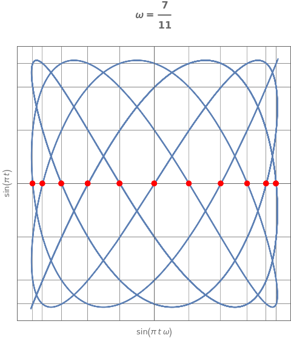
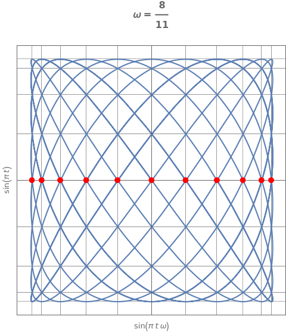
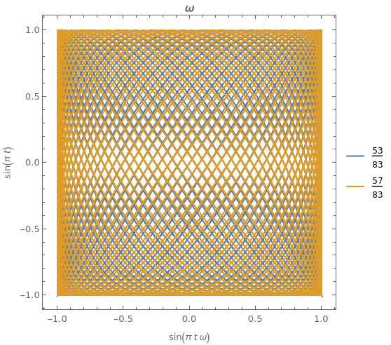
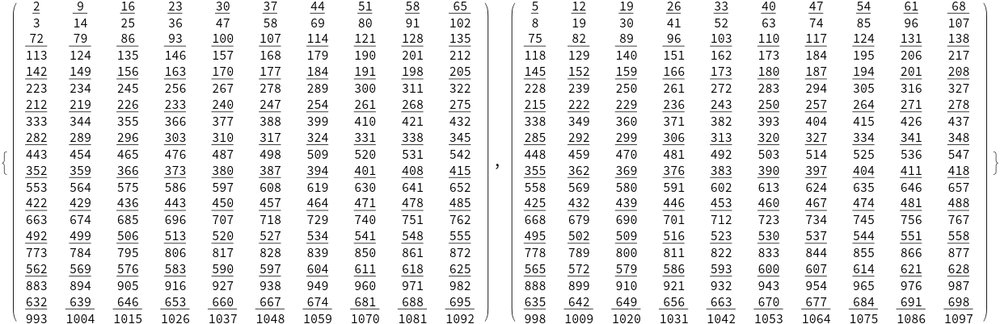
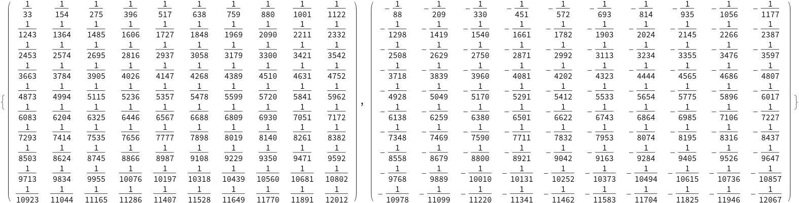

# Egyptian Fractions

Fast algorithm for representing rational numbers as egyptian fractions.

## Properties
* suitable for very large inputs
* returns rather small denominators

## Usage

```
Egyptian Fractions

Usage: egypt [OPTIONS] [NUMERATOR] [DENOMINATOR]

Arguments:
  [NUMERATOR]    [default: 1]
  [DENOMINATOR]  [default: 1]

Options:
  -r, --reverse        Reverse merge strategy
  -m, --merge          Extra merge step with quadratic complexity possibly reducing number of terms
      --raw            Output minimal number of raw quadruplets (aka symbolic sums)
  -s, --silent         No output
      --batch          Batch mode (expects numerator and denominator on each line of standard input)
  -l, --limit <LIMIT>  Maximum number of terms for breaking large symbolic sums [default: 2]
  -h, --help           Print help
  -V, --version        Print version
```

## Performance
```
$ time ./egypt -s 162259276829213363391578010288127 170141183460469231731687303715884105727

real    0m0.003s
user    0m0.002s
sys     0m0.001s
```

```
$ time ./egypt 999999 1000000``
1       2
1       4
1       8
1       16
1       33
1       50
1       83
1       12450
1       32912
1       49368
1       90387
1       285716
1       571432
1       1999996
1       685610442
1       2057423870
1       11904714285
1       83332333335
1       499999000000

real    0m0.002s
user    0m0.001s
sys     0m0.000s
```

---

## Examples

### 7 / 19

* Wolfram|Alpha
  * 1 / 3 + 1 / 29 + 1 / 1653   
* `egypt --merge --limit 19 7 19`
  * 1 / 3 + 1 / 33 + 1 / 209    

### 2023 / 2024
* Wolfram|Alpha
  * 1 / 2 + 1 / 3 + 1 / 7 + 1 / 43 + 1 / 16768 + 1 / 766160103 + 1 / 978335504948790912
* `egypt --merge --limit 2023 2023 2024`
  * 1 / 2 + 1 / 3 + 1 / 8 + 1 / 33 + 1 / 92
* `egypt --reverse --merge --limit 2023 2023 2024`
  * 1 / 2 + 1 / 3 + 1 / 7 + 1 / 43 + 1 / 18447 + 1 / 184184
* `egypt 2023 2024`
    *   1 / 2 + 1 / 4 + 1 / 8 + 1 / 11 + 1 / 33 + 1 / 674 + 1 / 899 + 1 / 2442 + 1 / 4044 + 1 / 24938 + 1 / 2046264 + 1 / 2423704

## Note

> * returns rather small denominators
>
When using legacy configuration `egypt --merge --limit <LIMIT> <NUMERATOR> <DENOMINATOR>`, where `LIMIT >= DENOMINATOR - 1`,
largest denominator factor should not be greater than original denominator. Fast default limit is however `2`,
which means that *bisecting* large symbolic sums can introduce bigger denominators. Moreover, `--limit` argument is itself
limited by `usize`, as opposed to other `BigInt` inputs.

---

## Illustrations

* Lissajous Curves: https://mathworld.wolfram.com/LissajousCurve.html







## Approximating rational numbers

by different rational numbers with denominator coprime to the original denominator

### 7 / 11


### 7 / 11 errors

